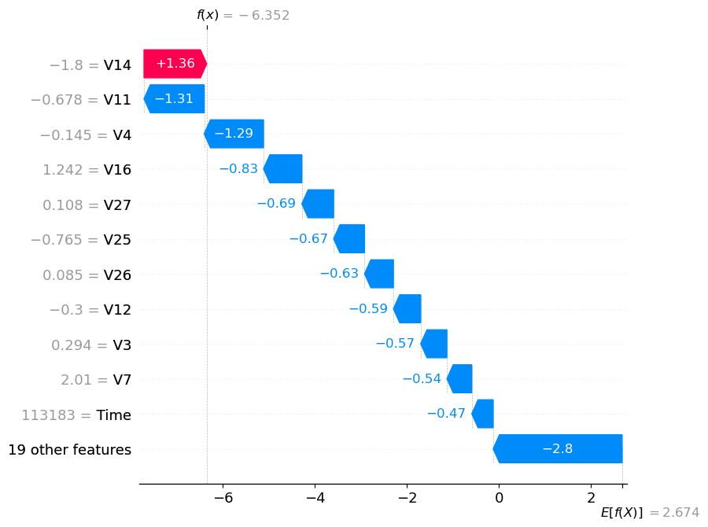
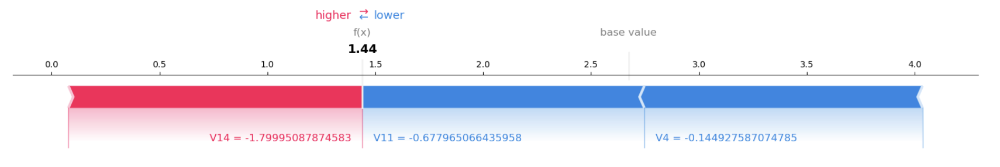

# Credit Card Fraud Detection (Imbalanced Classification)

# Overview

This project focuses on building and evaluating machine learning models for credit card fraud detection, a critical real-world problem in finance and cybersecurity characterized by extreme class imbalance and high decision risk.

The goal of the project is not only to achieve strong predictive performance, but also to handle skewed data correctly, evaluate models using appropriate metrics, and provide interpretable explanations for model decisions.

## Dataset

- Name: [Credit Card Fraud Dataset](https://www.kaggle.com/mlg-ulb/creditcardfraud)

- Size: 284,807 transactions

- Fraud Rate: ~0.17%

- Features:

      - V1–V28: anonymized PCA components

      - Time, Amount

- Target: Class (1 = fraud, 0 = legitimate)

### Why use a well-known dataset?

Although the dataset is well known, it is intentionally chosen for the following reasons:

1. Realistic problem structure
  
         Fraud represents less than 0.2% of all transactions, closely mirroring real-world fraud detection scenarios.

2. Industry relevance
  
         Credit card fraud detection is a core use case in banking, payments, and cybersecurity, making this dataset highly relevant for applied machine learning roles.

3. Focus on methodology over memorization
  
         The dataset’s anonymized features (PCA-transformed variables) shift the emphasis away from domain-specific heuristics and toward:
  
        - handling severe class imbalance
        - choosing appropriate evaluation metrics
        - model comparison and threshold optimization

4. Benchmarking and interpretability
  
         Using a well-established dataset allows results to be interpreted and compared meaningfully, while still leaving ample room for original modeling decisions,          evaluation strategies, and explanations.

Originality in this project comes from modeling choices, evaluation strategy, threshold analysis, and interpretability, not from proprietary data.

### Project Objectives

The project is designed to demonstrate the following skills:

- Handling highly imbalanced classification problems

- Building and comparing multiple models:

  - Logistic Regression

  - Random Forest

  - XGBoost

- Evaluating models using precision, recall, ROC-AUC, and PR-AUC instead of accuracy

- Performing threshold tuning to reflect real business trade-offs

- Explaining model predictions using SHAP for transparency and trust

### Modeling Approach

**Pipeline:**

**1.** Exploratory analysis with imbalance focus

**2.** Stratified train/test split

**3.** Logistic Regression (baseline, interpretable)

**4.** Random Forest (non-linear interactions)

**5.** XGBoost (industry-grade performance)

**6.** Evaluation using ROC-AUC & PR-AUC

**7.** Threshold tuning for operational trade-offs

**8.** Model explainability using SHAP    

### Model Comparison

### Precision–Recall Trade-off (Logistic Regression)

**Insight:**  

    - Logistic Regression achieves very high recall across a wide range of thresholds, meaning it is effective at detecting fraudulent transactions. 
      However, precision remains low at default thresholds, indicating a high number of false positives.

    - This highlights a common challenge in fraud detection: while linear models can identify risky patterns, they often lack the discriminative power 
    needed to reduce false alerts without sacrificing recall. As a result, Logistic Regression serves as a strong baseline but is insufficient 
    as a standalone production model.

### Feature Importance (Random Forest)

**Insight:**  

      - The Random Forest model identifies a small subset of features—particularly V14, V4, and V10—as dominant drivers of fraud predictions. 
        These variables correspond to latent transaction patterns rather than surface-level attributes such as transaction amount.

      - This suggests that fraudulent behavior is better characterized by complex feature interactions than by individual transaction magnitudes, 
       reinforcing the need for non-linear models in fraud detection.

### Precision–Recall Trade-off (Random Forest)

**Insight:**  

      - Compared to Logistic Regression, Random Forest achieves a more favorable precision–recall balance. Precision improves substantially at moderate 
        thresholds while recall remains relatively high.
      - This indicates that tree-based models are better suited to capture non-linear interactions that distinguish fraudulent from legitimate transactions, reducing         false positives without severely compromising fraud detection rates.

### Global Model Explainability (SHAP)

**Insight:**  

      - The SHAP summary plot reveals that a small number of features—most notably V14, V4, and V12—dominate the model’s predictions. 
        The color gradients show that  extreme values in these features push predictions strongly toward fraud or legitimacy.

      - This asymmetric behavior highlights how fraud detection depends on specific combinations of latent transaction characteristics rather 
        than uniform linear effects.

### Average Feature Impact (SHAP)

**Insight:**  

      - The mean absolute SHAP values confirm that V14 and V4 consistently exert the largest influence on model output across transactions. 
        This consistency indicates that the model’s decision logic is stable rather than driven by noise or rare edge cases.

### Local Explanation (Single Transaction)

The waterfall plot explains a single transaction by decomposing the model’s prediction into additive feature contributions:

- The model starts from a baseline prediction (average model output)

- Each feature pushes the prediction toward fraud (red) or toward legitimacy (blue)

- The final position represents the model’s output for this transaction

**Insight:**  

      - The SHAP waterfall plot decomposes the prediction for a single transaction into individual feature contributions. 
        Features such as V14 and V11 significantly push the prediction toward fraud, while others mitigate risk.

      - This level of transparency is critical in financial systems where model decisions must be explainable to auditors, regulators, and risk teams.

### Local Decision Patterns

The force plot visualizes the same prediction but displays all individual feature contributions:

- Features pushing the prediction higher are shown in red

- Features pushing the prediction lower are shown in blue

- The final prediction results from the balance of all opposing forces

Unlike the waterfall plot, no aggregation is performed, which can make the visualization more detailed but less compact.

**Insight:**  

     - Local explanation plots further illustrate how combinations of feature values jointly influence predictions, 
       providing intuitive insight into how fraud risk accumulates across multiple signals.

### Key Takeaway

Rather than treating fraud detection as a purely predictive task, this project frames it as a decision-making problem, where model performance, interpretability, and operational trade-offs must be considered together.

### Tools & Technologies

Python, Pandas, NumPy

Scikit-learn

XGBoost

SHAP

Matplotlib

      
